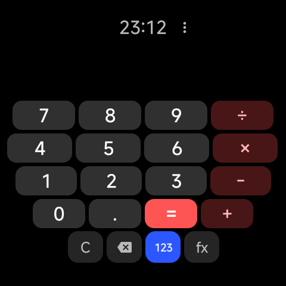
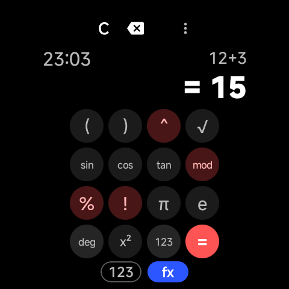
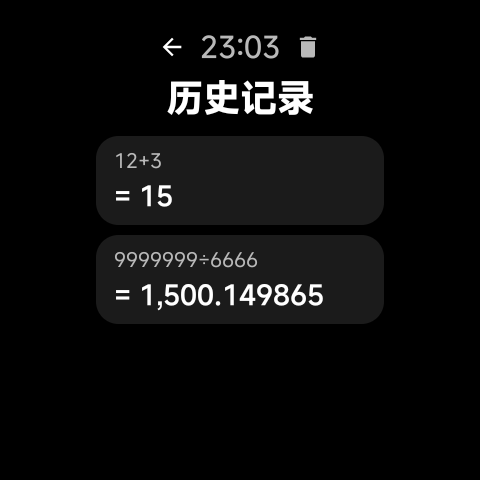
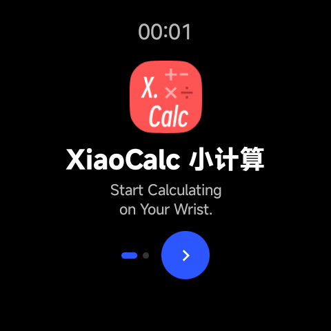

# XiaoCalc 小计算

面向 **安卓手表** 的离线计算器。Jetpack Compose + Material 3，单 APK、**零网络权限**——
不联网、不申请任何敏感权限、不收集任何数据。

圆屏与方屏均已适配：圆屏按几何弦长逐行贴合，方屏限制键长宽比并居中。

<p align="center">
  
  
  
  
</p>

---

## 功能

- **精确形式（保留根号与 π）**：可选输出精确值而不是浮点近似——
  `√8 → 2√2`、`√2×√3 → √6`、`2√2+3√2 → 5√2`、`√18-√8 → √2`、`π√2 → π√2`。
  作业要求保留根号或 π 时，不必再写近似值
- **四则运算与常用函数**：`sin` `cos` `tan` `ln` `√` `^` `mod` `π` `e`，支持括号嵌套
- **两种数字键位**：数字页与函数页一键切换
- **结果格式化**：科学计数法、千分位分隔、小数位自适应，超长结果自动缩放字号
- **角度 / 弧度制**可切换
- **历史记录**：计算历史本地持久化，点击可回填
- **旋转表冠**：列表与显示区可用表冠滚动（见下方「已知限制」）
- **触感反馈**：按键轻振，可关闭
- **诊断页**：一键查看屏幕规格、表冠支持、系统版本，便于反馈问题时报错

## 兼容性

| 项 | 要求 |
|---|---|
| 系统 | Android 8.0（API 26）及以上 |
| 屏幕 | 圆屏或方屏，任意分辨率（按设计单位等比缩放） |
| 权限 | 无。仅使用 `adb` 安装时需要开发者模式 |
| 包大小 | 约 1.6 MB（R8 + 资源压缩，内置 4 个字重中文字体子集） |

已在 **小米手表 M2505W1（Android 14，480×480 @320dpi，圆形）** 上完成实机验证。
方屏布局由无设备渲染测试覆盖，尚未在方屏真机上验证。

## 安装

从 [Releases](https://github.com/xiaoxlh/XiaoCalc/releases) 下载 APK 后安装：

```bash
adb install -r XiaoCalc-<版本>.apk
```

> 若设备上已装过其他签名的版本，需先卸载——签名不同的 APK 无法覆盖安装，
> 卸载会一并清除历史记录与设置。

## 从源码构建

需要 **JDK 17**；`local.properties` 中的 `sdk.dir` 指向 Android SDK。

```bash
./gradlew :app:assembleDebug          # 构建 debug APK
./gradlew :app:testDebugUnitTest      # 单元测试（纯 JVM）
./gradlew :app:recordPaparazziDebug   # 重新录制 UI 截图基线
./gradlew :app:verifyPaparazziDebug   # 与基线比对，可用于 CI
```

发布版需要仓库根目录下的 `keystore.properties`（**不入库**）：

```properties
storeFile=你的密钥库.jks
storePassword=…
keyAlias=…
keyPassword=…
```

```bash
./gradlew :app:assembleRelease
```

## 设计要点

### 圆屏：逐行贴合弦长

把整块键盘塞进一个统一宽度的正方形会受内接约束（R·√2），每行都被最窄的一行拖累，
左右留下大片空白。改为**逐行按该行纵向区间的最窄弦长定宽**：

```
行宽 = chordInBand(行 top, 行 bottom) × 0.96
键宽 = (行宽 − (列数−1) × 键距) / 列数
```

得到一块贴合圆形的梯形键盘：中间最宽、向下逐行收窄，两侧空白被真正利用。
这些是**可断言的几何约束**，由单元测试固化（四角必须落在圆内、行填充率 ≥ 90%），
而不是靠肉眼调数值。

方屏没有圆形约束，硬铺满只会得到又扁又宽的键，因此改为限制键长宽比并居中，
底部操作行与键盘网格等宽。

### 字体

内置 MiSans 的四个字重，按应用**实际会渲染的字符**做子集化，
共约 396 KB（相对原始字体文件减小约 98.7%）。子集脚本带字形校验，
缺失字符会在构建期暴露，而不是等到真机上显示成方块。

### 表冠

手表表冠以滚动事件形式送达，但**各家系统是否派发给第三方应用并不一致**。
应用在页面层统一接收，滚动走减速补间以获得顺滑手感。
若你的设备上表冠无响应，可在「设置 → 诊断信息」中查看硬件是否被识别。

## 数据与隐私

- **不联网**：应用未声明网络权限。
- **本地存储**：设置与历史记录仅保存在应用私有目录，卸载即清除。
- 存储键沿用早期版本，升级不会丢失已有配置。

历史记录使用自定义行编码（不引入 JSON 库以控制包体积），对分隔符与反斜杠做转义。

## 已知限制

- **按键偏宽偏矮**：圆屏上键宽由该行弦长决定，而键高受纵向预算限制。
  触摸面积充足，但观感是横向的"宽键"而非方键。
- **键盘固定 4 列**：`(` `)` 等符号放在函数页，不随表盘增大而增加列数，
  以保持一致的肌肉记忆。
- **方屏未经真机验证**：布局由渲染测试覆盖，实机手感待反馈。
- **表冠依赖系统**：部分设备的系统不向第三方应用派发旋转事件。
- **非精密计算工具**：请勿用于任何要求高精度或高可靠性的场合。

## 许可

[Apache License 2.0](LICENSE)
